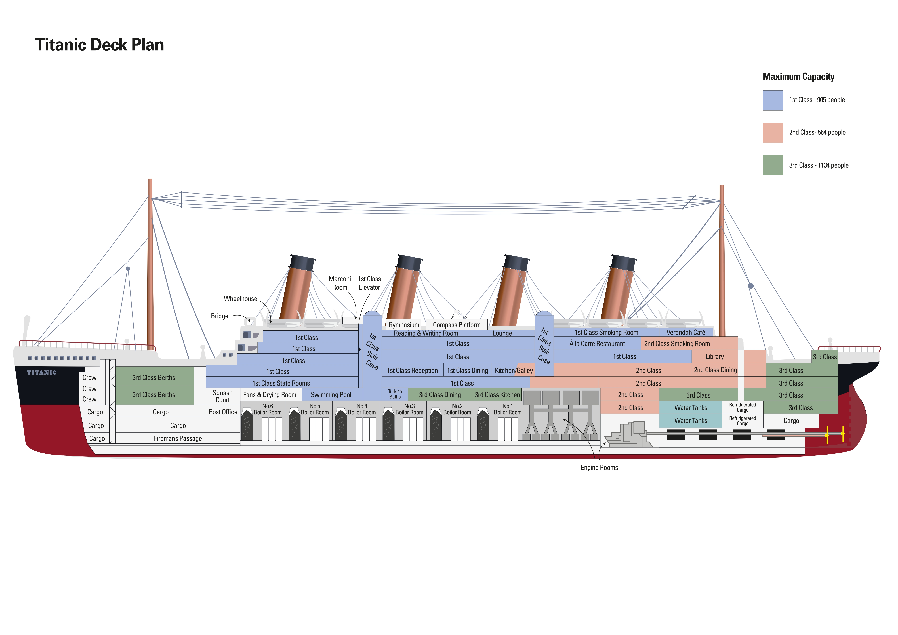

# Titanic
[Kaggle](https://www.kaggle.com/competitions/titanic)

Описание данных:

1. PassengerId - айди пассажира
2. Survived - выжил ли (1 = да, 0 = нет)
3. Pclass - класс билета (1 = первый, 2 = средний, 3 = эконом)
4. Name - имя и фамилия пассажира
5. Sex - пол пассажира
6. Age - возраст пассажира
7. SibSp - количество братьев, сестер и супруга на борту
8. Parch - количество родителей и детей на борту
9. Ticket - номер билета
10. Fare - стоимость билета
11. Cabin - номер каюты
12. Embarked - порт посадки (C = Cherbourg, Q = Queenstown, S = Southampton)

